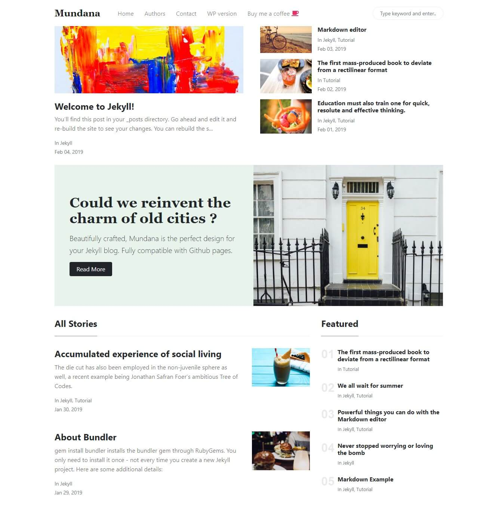

All posts can be found in the `posts` folder in the master branch. Use existing posts as a format reference. 
Click `_posts` to enter the folder. You can click an existing post file to view it. Click the pencil icon to view the post in markdown and to edit it. 
Back in the `_posts` folder, click **Create new file** to create a new post.

The head of each post will contain the following:
```
---
layout: post
title:  "6 reasons your values are not aligned with your company"
author: advantages
categories: [ Business ]
image: assets/images/blog002.jpg
tags: [sticky, featured]
---
```
Layout will always be `post`
Title is the title of the post.
The author is your first name in all lowercase.
You can add as many categories as you wish within the brackets, seperated by a comma.
Change the image name to reflect the image you uploaded. Do not change the path though. For example, `assets/images/blog003.jpg`
Tags are optional. `sticky` means that post will go inside of the large rectangle. `featured` means the post will go in the featured list on the bottom right of the page.

Please refer to the [Markdown cheatsheet](https://www.markdownguide.org/cheat-sheet/) to learn about writing in markdown.

To add images, enter `assets` folder. Within assets, enter `images` folder. Use the set naming convention of `blog00X` to name images for posts. Try to use `.jpg` images.


# Jekyll Theme - Mundana

[Live Demo](https://wowthemesnet.github.io/mundana-theme-jekyll/) &nbsp; | &nbsp; 
[Download](https://github.com/wowthemesnet/mundana-theme-jekyll/archive/master.zip) &nbsp; | &nbsp; 
[Buy me a coffe](https://www.wowthemes.net/donate/) &nbsp; | &nbsp; [Documentation](https://bootstrapstarter.com/bootstrap-templates/mundana-theme-jekyll/) &nbsp; | &nbsp; 
[WordPress version](https://www.wowthemes.net/themes/mundana-wordpress/) 



### Documentation

[How to install & use](https://bootstrapstarter.com/bootstrap-templates/mundana-theme-jekyll/)

### Contribute to Mundana repository

1. In the top-right corner of this page, click **Fork**.

2. Clone a copy of your fork on your local, replacing *YOUR-USERNAME* with your Github username.

   `git clone https://github.com/YOUR-USERNAME/mundana-theme-jekyll.git`

3. **Create a branch**: 

   `git checkout -b <my-new-feature-or-fix>`

4. **Make necessary changes and commit those changes**:

   `git add .`

   `git commit -m "new feature or fix"`

5. **Push changes**, replacing `<add-your-branch-name>` with the name of the branch you created earlier at step #3. :

   `git push origin <add-your-branch-name>`

6. Submit your changes for review. Go to your repository on GitHub, you'll see a **Compare & pull request** button. Click on that button. Now submit the pull request.

That's it! Soon I'll be merging your changes into the master branch of this project. You will get a notification email once the changes have been merged. Thank you for your contribution.


### Copyright

Copyright (C) 2019 WowThemes.net.

Theme designed and developed by [Sal](https://www.wowthemes.net), *free* under MIT license. 

<a href="https://www.wowthemes.net/donate/" target="_blank"></a>

### Live Demo

[Live Demo](https://wowthemesnet.github.io/mundana-theme-jekyll/)
